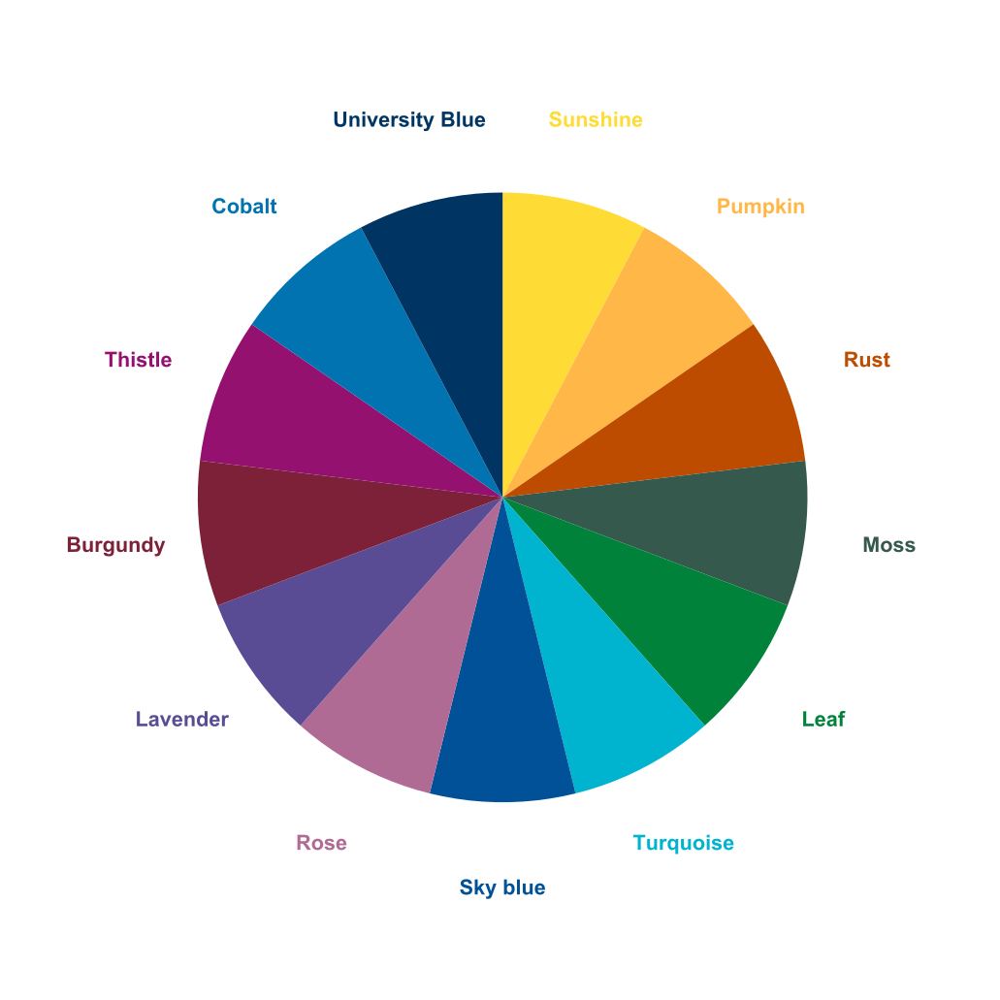
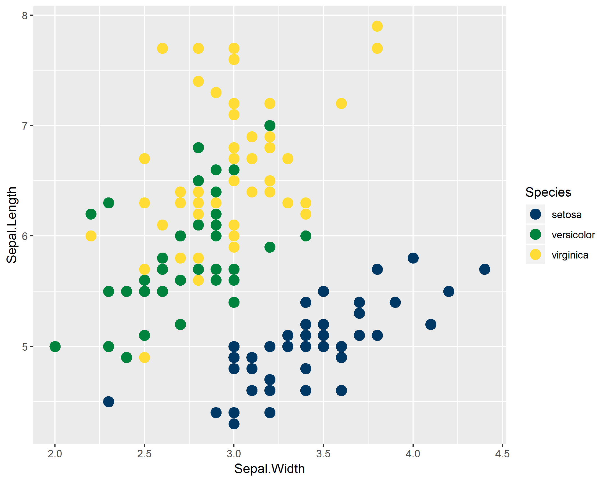
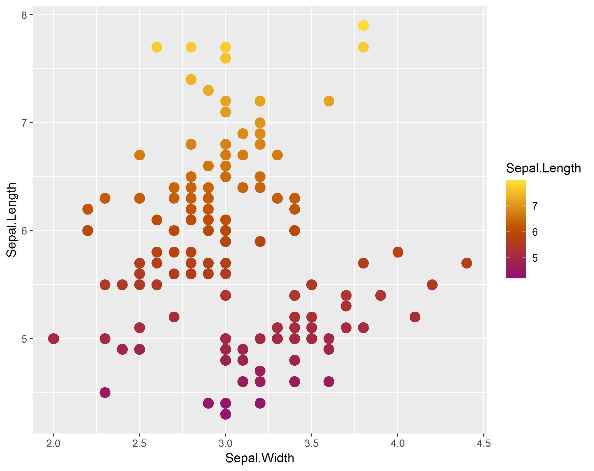
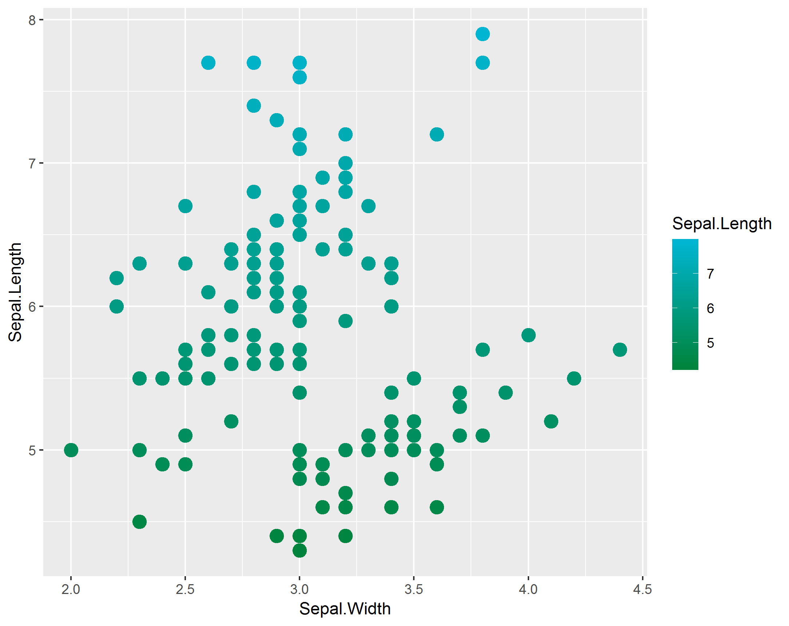
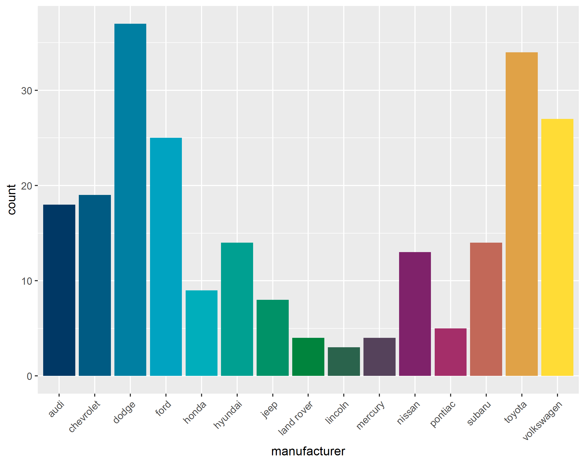

<!-- badges: start -->
[](https://ci.appveyor.com/project/andrewbaxter439/SPHSUgraphs)
[](https://github.com/andrewbaxter439/SPHSUgraphs/actions)
<!-- badges: end -->


# SPHSU graphics for graphs
For applying Unit colour scales and other theme aesthetics to ggplot2 plots

## The Unit Palette

Use `sphsu_show_colours()` to show the range of named colours you can use:



## Adding a palette

Colour and fill functions have four pre-installed palettes: "main", "hot", "cool" and "mixed". You can add a custom palette like so:

```
sphsu_palettes$newname <- sphsu_cols("Cobalt", "Thistle", "Leaf")
```

You can then use this new palette name in calls of `scale_fill_sphsu` and `scale_colour_sphsu` (see below).

## Using in ggplot

Right now the main output of these functions is to apply colour and fill scales to your `ggplot2` graphics, by adding a `scale_` function at the end of your call.

Examples:

```
ggplot(iris, aes(Sepal.Width, Sepal.Length, col = Species)) +
  geom_point(size = 4) +
  scale_colour_sphsu()
```



```
ggplot(iris, aes(Sepal.Width, Sepal.Length, col = Sepal.Length)) +
  geom_point(size = 4) +
  scale_colour_sphsu("hot", discrete = FALSE)
```



```
ggplot(iris, aes(Sepal.Width, Sepal.Length, col = Sepal.Length)) +
  geom_point(size = 4) +
  scale_colour_sphsu("cool", discrete = FALSE)
```



```
ggplot(mpg, aes(manufacturer, fill = manufacturer)) +
  geom_bar() +
  theme(axis.text.x = element_text(angle = 45, hjust = 1)) +
  scale_fill_sphsu(palette = "mixed", guide = "none")
```



# Acknowledgements

This package was developed from the helpful walkthrough at [Simon Jackson's blogpost](https://drsimonj.svbtle.com/creating-corporate-colour-palettes-for-ggplot2) on creating colour palettes (Accessed 08/11/2019). With thanks to [@drsimonj](https://www.twitter.com/drsimonj)! 
