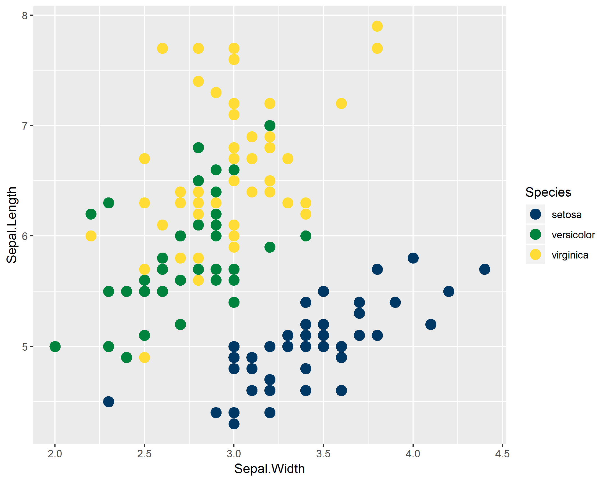
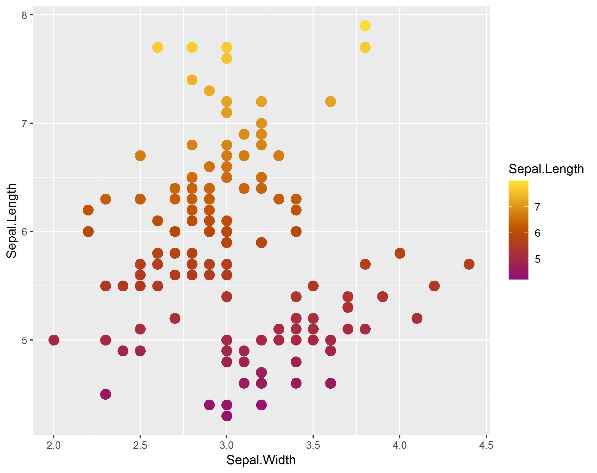
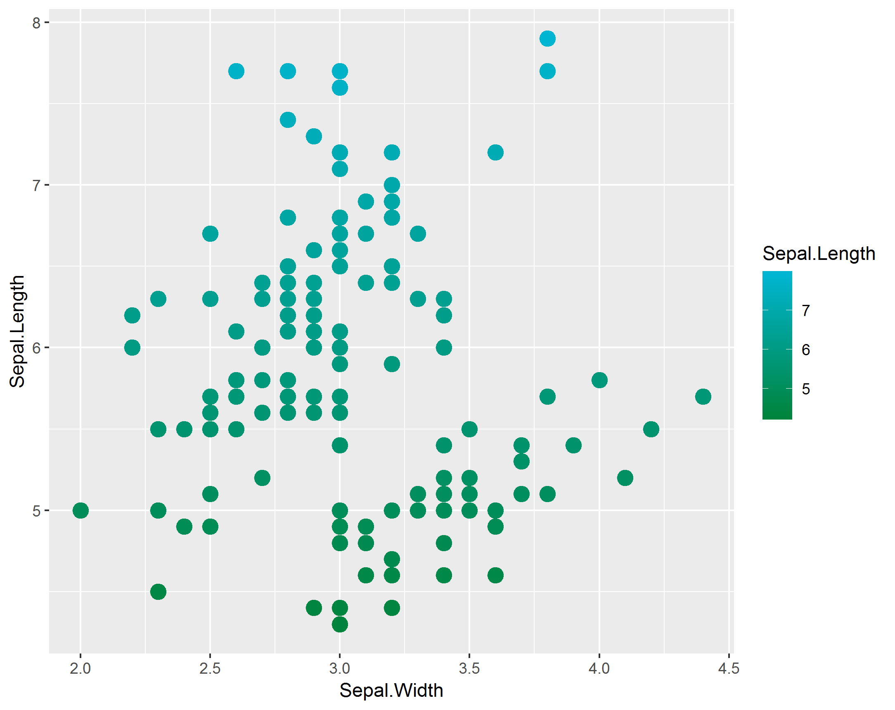
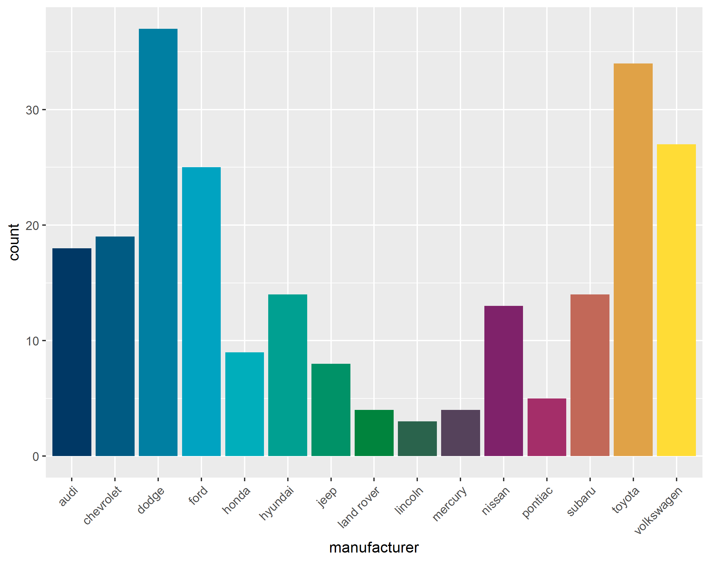

# SPHSU_graphics
For applying Unit colour scales and other theme aesthetics to ggplot2 plots

## Using in ggplot

Right now the main output of these functions is to apply colour and fill scales to your `ggplot2` graphics, by adding a `scale_` function at the end of your call.

Examples:

```
ggplot(iris, aes(Sepal.Width, Sepal.Length, col = Species)) +
  geom_point(size = 4) +
  scale_color_sphsu()
```



```
ggplot(iris, aes(Sepal.Width, Sepal.Length, col = Sepal.Length)) +
  geom_point(size = 4) +
  scale_color_sphsu("hot", discrete = FALSE)
```



```
ggplot(iris, aes(Sepal.Width, Sepal.Length, col = Sepal.Length)) +
  geom_point(size = 4) +
  scale_color_sphsu("cool", discrete = FALSE)
```



```
ggplot(mpg, aes(manufacturer, fill = manufacturer)) +
  geom_bar() +
  theme(axis.text.x = element_text(angle = 45, hjust = 1)) +
  scale_fill_sphsu(palette = "mixed", guide = "none")
```


